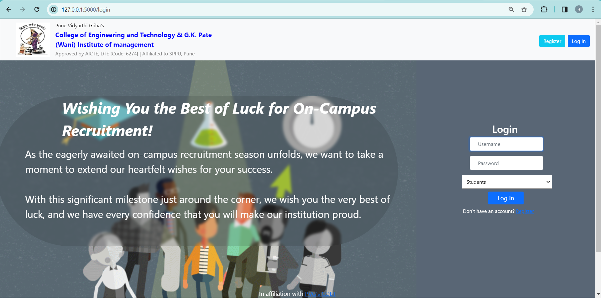
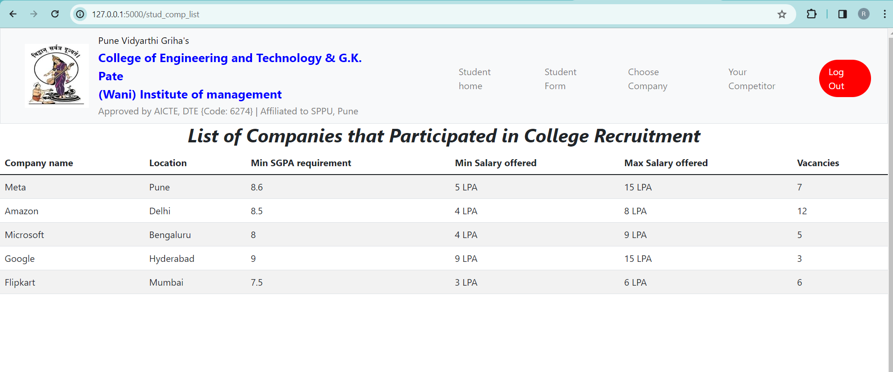
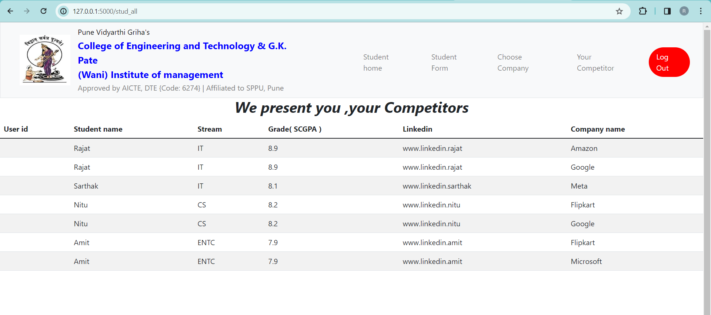
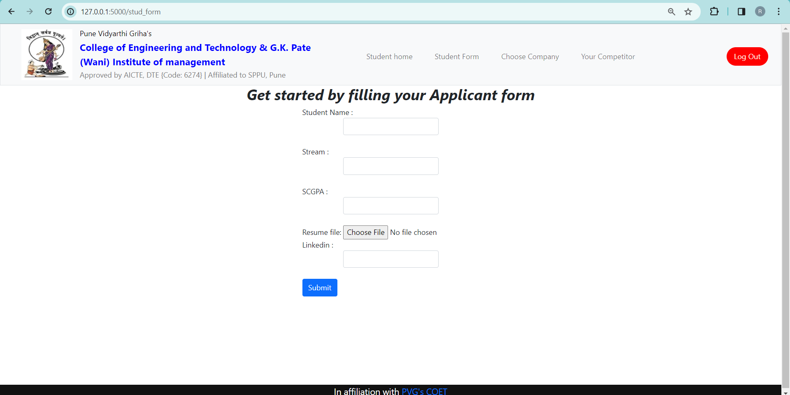
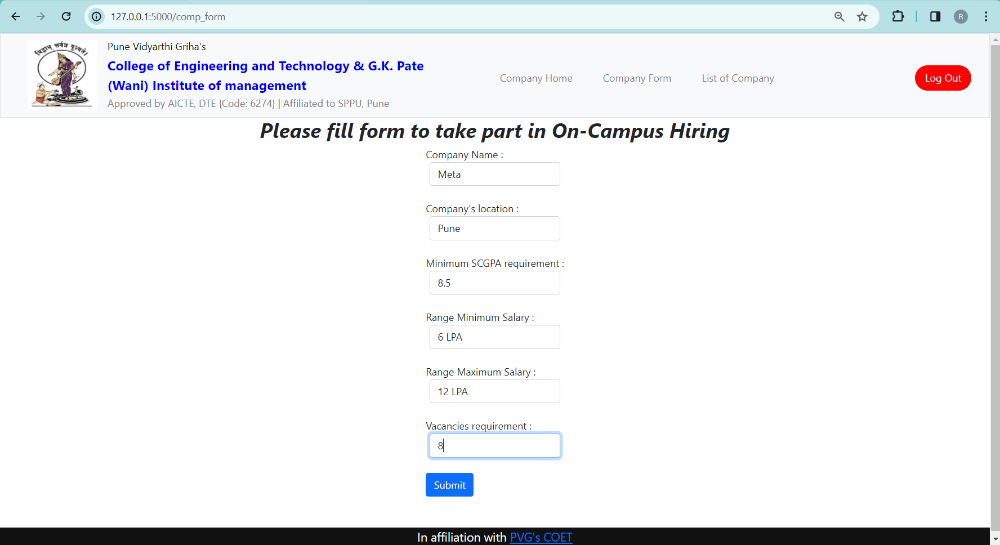

# On Campus Recruitment - Flask

🌐 **Dive into the world of campus recruitment with our dynamic "On Campus Hiring Website with Flask"!** 🚀 Empower your campus's hiring process as students seamlessly connect with companies through this Flask-based platform. 💼👩‍💻 Explore user, applicant, and company details along with hiring requests across five essential tables.🌟

## Overview

This 🌐Flask-based website revolutionizes campus recruitment🚀, offering a seamless platform for students and companies to connect. Explore user, applicant, and company details along with hiring requests across five essential tables.

## Screenshots

### Website Homepage

### List of Companies Page

### List of Student Page

### Applicant Form Page

### Company Form Page

## YouTube Tutorial

Watch the YouTube tutorial to learn how to set up and use this project. The tutorial provides a step-by-step guide on running the application and utilizing its features.

## How to Use

To run this code, you need to install:

1. Flask: `pip install Flask`
2. CS50: `pip install cs50`
3. Flask-Session: `pip install Flask-Session`

After installation, run `flask run` in the terminal.

## Technologies Used

- Flask 🚀
- Python 🐍
- CS50XFinalProject 📚
- Harvard 🎓

## Tags

#Flask #RecruitmentInnovation #CS50XFinalProject #CS50 #finalproject #Harvard #website

## License

This project is licensed under the MIT License - see the [LICENSE](LICENSE) file for details.
